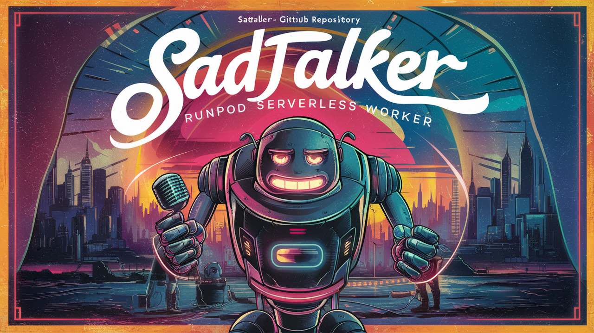

# RunPod Serverless SadTalker Worker



This project allows users to install SadTalker, an AI model that generates realistic lip-sync videos on RunPod serverless platform.

## Docker image

Docker image available at: [Docker Hub](https://hub.docker.com/repository/docker/drvpn/runpod_serverless_sadtalker_worker)

## Environment Variables

To run this application on RunPod serverless, you need to set the following environment variables:

- `BUCKET_ENDPOINT_URL`: The endpoint URL of your S3-compatible storage.
- `BUCKET_ACCESS_KEY_ID`: The access key ID for your S3-compatible storage.
- `BUCKET_SECRET_ACCESS_KEY`: The secret access key for your S3-compatible storage.

These variables are required to store and host the enhanced MP4 video files.

## Running on RunPod Serverless

### 1. `Clone the Repository`

```sh
git clone https://github.com/drvpn/runpod_serverless_sadtalker_worker.git
cd runpod_serverless_sadtalker_worker
```

2. `Build and Push Docker Image`
   - Follow RunPod's documentation to build and push your Docker image to a container registry.

3. `Deploy on RunPod`
   - Go to RunPod's dashboard and create a new serverless function.
   - Use the Docker image you pushed to your container registry.
   - Set the environment variables: `BUCKET_ENDPOINT_URL`, `BUCKET_ACCESS_KEY_ID`, `BUCKET_SECRET_ACCESS_KEY`.

4. `Invoke the Function`

You can invoke the function with a JSON payload specifying the input video URL. Here is an example:

```sh
{
  "input": {
    "input_image_url": "https://www.example.com/Eduardo_RedJacket.png",
    "input_audio_url": "https://www.example.com/audio_Eduardo_30seconds.mp3"
  }
}
```

Use RunPod's interface or an HTTPS client (i.e. Postman) to send this payload to the deployed function.

# Input
- `input_image_url`: The image of the face you want to perform lip-sync (png)(required)
- `input_audio_url`: The audio you want to sync to (wav)(required)
- `batch_size`: The number of sample frames processed in a single pass during inference.
- `device`: The hardware to use during inference, one of ['`cpu`', '`gpu`']
- `enhancer`: The face image enhancer & upscaler to use, one of ['`gfpgan`', '`RestoreFormer`']
- `expression_scale`: Expressive Mode, a larger value will make the expression motion stronger.
- `pose_style`: Values should be between 4 and 45. This will affect the head movement.
- `preprocess`: Adjusting the size of the input frames to match the model's requirements, one of ['`crop`', '`resize`', '`full`']
- `ref_eyeblink_url`: A URL to a video file referencing the eye blink you would like to mimic (mp4)
- `ref_pose_url`: A URL to a video file refrencing the pose you would like to mimic (mp4)
- `size`: Face model resolution, one of [`256`, `512`]
- `still`: Using the same pose parameters as the original image, fewer head motion, one of [`true`, `false`]

# Default values
- `input_image_url`: required `no default`
- `input_audio_url`: required `no default`
- `batch_size`: default value is `2`
- `device`: default value is `cuda`
- `enhancer`: default value is `gfpgan`
- `expression_scale`: default value is `1.0`
- `pose_style`: default value is `45`
- `preprocess`: default value is `full`
- `ref_eyeblink_url`: `no default`
- `ref_pose_url`: `no default`
- `size`: default is `512`
- `still`: default is `true`

To override default values, you can set the following (optional) environment variables:

- `DEFAULT_BATCH_SIZE`: sets new default for batch size
- `DEFAULT_DEVICE`: sets new default for device, one of ['`cpu`', '`gpu`']
- `DEFAULT_ENHANCER`: sets new default for enhancer, one of ['`gfpgan`', '`RestoreFormer`']
- `DEFAULT_POSE_STYLE`: set new default for pose style, range between 0 and 45.
- `DEFAULT_PREPROCESS`: set new default preprocess adjustment, one of ['`crop`', '`resize`', '`full`']
- `DEFAULT_REF_EYEBLINK_URL`: set new default eye blink URL (mp4)
- `DEFAULT_REF_POSE_URL`: set new default pose video URL (mp4)
- `DEFAULT_SIZE`: set new default resolution, one of [`256`, `512`]
- `DEFAULT_STILL`: set new default pose parameter, one of [`true`, `false`]

## Example return value
```sh
{
  "delayTime": 491,
  "executionTime": 135484,
  "id": "your-unique-id-will-be-here",
  "output": {
    "output_video_url": "https://mybucket.nyc3.digitaloceanspaces.com/SadTalker/2024_06_16_16.20.48.mp4"
  },
  "status": "COMPLETED"
}
```
# Handler Explanation

The `handler.py` script orchestrates the following tasks:

- Maps a network volume to store checkpoints (if available).
- Downloads and caches model checkpoints if not already present.
- Combines your image and audio produce a lip synced video.
- Uploads the generated audio file to S3-compatible storage and returns the public URL.

## Contributing

Contributions are welcome! Please open an issue or submit a pull request.

## License

This project is licensed under the MIT License.
